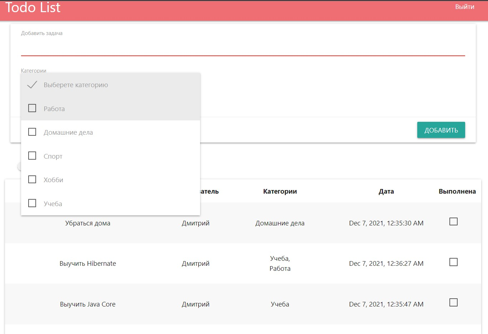
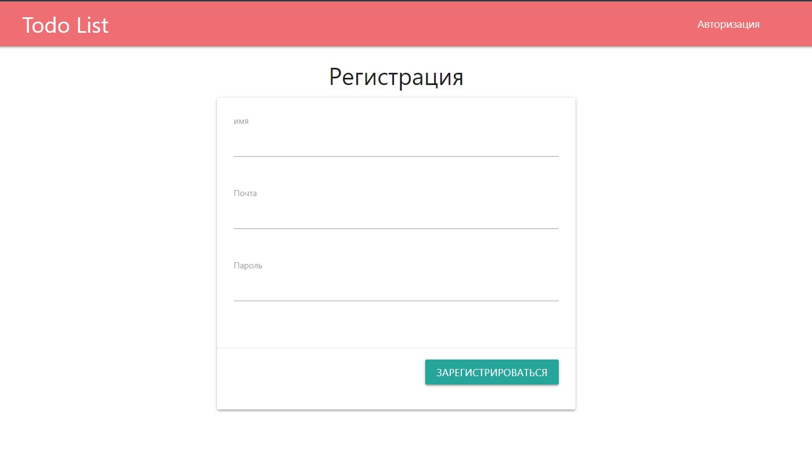

# job4j_todo

 
 
 ###Технологии 
+ Java 15
+ Java EE Servlets
+ PostgreSQL, Hibernate
+ Maven, Tomcat
+ HTML, JavaScript, jQuery, JSON

Проект ToDo лист - это список дел. Задачи можно добавлять в список через форму, 
если задача выполнена то она удаляется из списка, если включена функция показать 
все то будут показаны все задачи. Есть категории задач, у каждой задачи может быть несколько категорий

## Главная страница

Основной функционал программы доступен только для зарегистрированных пользователей 

## Страница авторизации

## Страница регистрации

