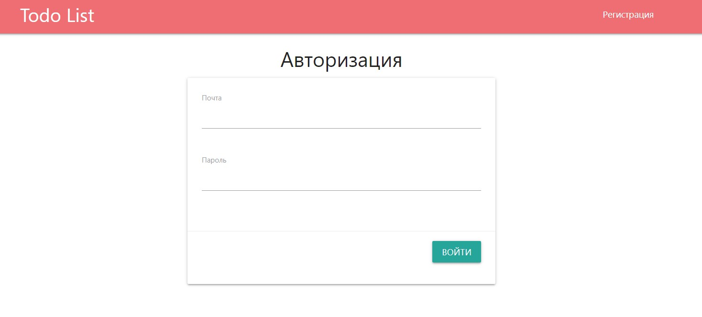

# job4j_todo

Проект ToDo лист - список заданий. Задачи можно добавлять в список через форму, если задача выполнена то она удаляется из списка, если включена функция показать все то будут показаны все задачи.

## Главная страница

